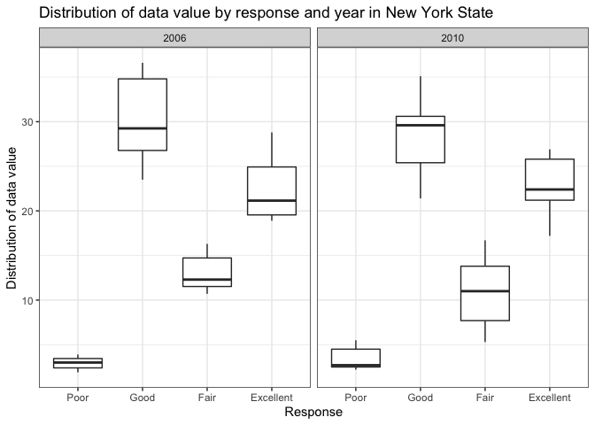

Homework 3
================
Jessica Lavery
Due: 10/14/2019

# Problem 1

``` r
# load the dataset of interest
data("instacart")

# look at overview of dataset
# str(instacart)

# calculate the number of items per order
n_per_order <- instacart %>% 
  group_by(user_id, order_id) %>% 
  summarize(n_items = n())
```

The instacart dataset is in the structure of 1 record per item per order
and contains 1384617 records pertaining to information on 131209 users
and 131209 oders.

There are 15 variables containing key information such as a customer ID,
the number of days since their prior order (truncated at 30 days), a
product identifier and indication of whether that item has been
purchased before, the name of the product as well as the aisle and
department that it can be found, as well as the time of the instacart
purchase. An example of a few products from a single customer’s order
can be seen below:

``` r
head(instacart) %>% kable()
```

<table>

<thead>

<tr>

<th style="text-align:right;">

order\_id

</th>

<th style="text-align:right;">

product\_id

</th>

<th style="text-align:right;">

add\_to\_cart\_order

</th>

<th style="text-align:right;">

reordered

</th>

<th style="text-align:right;">

user\_id

</th>

<th style="text-align:left;">

eval\_set

</th>

<th style="text-align:right;">

order\_number

</th>

<th style="text-align:right;">

order\_dow

</th>

<th style="text-align:right;">

order\_hour\_of\_day

</th>

<th style="text-align:right;">

days\_since\_prior\_order

</th>

<th style="text-align:left;">

product\_name

</th>

<th style="text-align:right;">

aisle\_id

</th>

<th style="text-align:right;">

department\_id

</th>

<th style="text-align:left;">

aisle

</th>

<th style="text-align:left;">

department

</th>

</tr>

</thead>

<tbody>

<tr>

<td style="text-align:right;">

1

</td>

<td style="text-align:right;">

49302

</td>

<td style="text-align:right;">

1

</td>

<td style="text-align:right;">

1

</td>

<td style="text-align:right;">

112108

</td>

<td style="text-align:left;">

train

</td>

<td style="text-align:right;">

4

</td>

<td style="text-align:right;">

4

</td>

<td style="text-align:right;">

10

</td>

<td style="text-align:right;">

9

</td>

<td style="text-align:left;">

Bulgarian Yogurt

</td>

<td style="text-align:right;">

120

</td>

<td style="text-align:right;">

16

</td>

<td style="text-align:left;">

yogurt

</td>

<td style="text-align:left;">

dairy eggs

</td>

</tr>

<tr>

<td style="text-align:right;">

1

</td>

<td style="text-align:right;">

11109

</td>

<td style="text-align:right;">

2

</td>

<td style="text-align:right;">

1

</td>

<td style="text-align:right;">

112108

</td>

<td style="text-align:left;">

train

</td>

<td style="text-align:right;">

4

</td>

<td style="text-align:right;">

4

</td>

<td style="text-align:right;">

10

</td>

<td style="text-align:right;">

9

</td>

<td style="text-align:left;">

Organic 4% Milk Fat Whole Milk Cottage Cheese

</td>

<td style="text-align:right;">

108

</td>

<td style="text-align:right;">

16

</td>

<td style="text-align:left;">

other creams cheeses

</td>

<td style="text-align:left;">

dairy eggs

</td>

</tr>

<tr>

<td style="text-align:right;">

1

</td>

<td style="text-align:right;">

10246

</td>

<td style="text-align:right;">

3

</td>

<td style="text-align:right;">

0

</td>

<td style="text-align:right;">

112108

</td>

<td style="text-align:left;">

train

</td>

<td style="text-align:right;">

4

</td>

<td style="text-align:right;">

4

</td>

<td style="text-align:right;">

10

</td>

<td style="text-align:right;">

9

</td>

<td style="text-align:left;">

Organic Celery Hearts

</td>

<td style="text-align:right;">

83

</td>

<td style="text-align:right;">

4

</td>

<td style="text-align:left;">

fresh vegetables

</td>

<td style="text-align:left;">

produce

</td>

</tr>

<tr>

<td style="text-align:right;">

1

</td>

<td style="text-align:right;">

49683

</td>

<td style="text-align:right;">

4

</td>

<td style="text-align:right;">

0

</td>

<td style="text-align:right;">

112108

</td>

<td style="text-align:left;">

train

</td>

<td style="text-align:right;">

4

</td>

<td style="text-align:right;">

4

</td>

<td style="text-align:right;">

10

</td>

<td style="text-align:right;">

9

</td>

<td style="text-align:left;">

Cucumber Kirby

</td>

<td style="text-align:right;">

83

</td>

<td style="text-align:right;">

4

</td>

<td style="text-align:left;">

fresh vegetables

</td>

<td style="text-align:left;">

produce

</td>

</tr>

<tr>

<td style="text-align:right;">

1

</td>

<td style="text-align:right;">

43633

</td>

<td style="text-align:right;">

5

</td>

<td style="text-align:right;">

1

</td>

<td style="text-align:right;">

112108

</td>

<td style="text-align:left;">

train

</td>

<td style="text-align:right;">

4

</td>

<td style="text-align:right;">

4

</td>

<td style="text-align:right;">

10

</td>

<td style="text-align:right;">

9

</td>

<td style="text-align:left;">

Lightly Smoked Sardines in Olive Oil

</td>

<td style="text-align:right;">

95

</td>

<td style="text-align:right;">

15

</td>

<td style="text-align:left;">

canned meat seafood

</td>

<td style="text-align:left;">

canned goods

</td>

</tr>

<tr>

<td style="text-align:right;">

1

</td>

<td style="text-align:right;">

13176

</td>

<td style="text-align:right;">

6

</td>

<td style="text-align:right;">

0

</td>

<td style="text-align:right;">

112108

</td>

<td style="text-align:left;">

train

</td>

<td style="text-align:right;">

4

</td>

<td style="text-align:right;">

4

</td>

<td style="text-align:right;">

10

</td>

<td style="text-align:right;">

9

</td>

<td style="text-align:left;">

Bag of Organic Bananas

</td>

<td style="text-align:right;">

24

</td>

<td style="text-align:right;">

4

</td>

<td style="text-align:left;">

fresh fruits

</td>

<td style="text-align:left;">

produce

</td>

</tr>

</tbody>

</table>

1.  How many aisles are there, and which aisles are the most items
    ordered from?

There is data on products from 134 aisles in the instacart dataset.

As shown below, the most items are ordered from the fresh vegetables
aisle, followed by the fresh fruits aisle.

``` r
# count number of items purchased from each aisle
items_per_aisle <- instacart %>% 
  group_by(aisle) %>% 
  summarize(n_items = n()) 

items_per_aisle %>% 
  arrange(desc(n_items))
```

    ## # A tibble: 134 x 2
    ##    aisle                         n_items
    ##    <chr>                           <int>
    ##  1 fresh vegetables               150609
    ##  2 fresh fruits                   150473
    ##  3 packaged vegetables fruits      78493
    ##  4 yogurt                          55240
    ##  5 packaged cheese                 41699
    ##  6 water seltzer sparkling water   36617
    ##  7 milk                            32644
    ##  8 chips pretzels                  31269
    ##  9 soy lactosefree                 26240
    ## 10 bread                           23635
    ## # … with 124 more rows

The fewest items are ordered from the beauty aisle, followed by the
frozen juice and baby accessories aisles.

``` r
items_per_aisle %>% 
  arrange(n_items)
```

    ## # A tibble: 134 x 2
    ##    aisle                      n_items
    ##    <chr>                        <int>
    ##  1 beauty                         287
    ##  2 frozen juice                   294
    ##  3 baby accessories               306
    ##  4 baby bath body care            328
    ##  5 kitchen supplies               448
    ##  6 specialty wines champagnes     461
    ##  7 ice cream toppings             504
    ##  8 shave needs                    532
    ##  9 skin care                      534
    ## 10 first aid                      539
    ## # … with 124 more rows

2.  Make a plot that shows the number of items ordered in each aisle,
    limiting this to aisles with more than 10,000 items ordered. Arrange
    aisles sensibly, and organize your plot so others can read it.

<!-- end list -->

``` r
items_per_aisle %>% 
  filter(n_items >= 10000) %>% 
  mutate(aisle = fct_reorder(factor(str_to_sentence(aisle)), n_items)) %>% 
  ggplot(aes(x = aisle, y = n_items)) +
  geom_bar(stat = "identity") +
  theme_minimal() +
  labs(title = "Number of items ordered in each aisle",
       x = "Aisle",
       y = "Number of items", 
       caption = "Note: Aisles with fewer than 10,000 items purchased were excluded from this figure.") +
  coord_flip()
```

<!-- -->

3.  Make a table showing the three most popular items in each of the
    aisles “baking ingredients”, “dog food care”, and “packaged
    vegetables fruits”. Include the number of times each item is ordered
    in your table.

Table. Top 3 most popular items in select
aisles.

``` r
# count number of times each item within each aisle was purchased, then get top 3 items per aisle
instacart %>% 
  filter(aisle %in% c("baking ingredients", "dog food care", "packaged vegetables fruits")) %>% 
  group_by(aisle, product_name) %>%
  summarize(n_times_ordered = n()) %>%
  group_by(aisle) %>%
  arrange(aisle, desc(n_times_ordered)) %>% 
  top_n(3, n_times_ordered) %>% 
  kable()
```

<table>

<thead>

<tr>

<th style="text-align:left;">

aisle

</th>

<th style="text-align:left;">

product\_name

</th>

<th style="text-align:right;">

n\_times\_ordered

</th>

</tr>

</thead>

<tbody>

<tr>

<td style="text-align:left;">

baking ingredients

</td>

<td style="text-align:left;">

Light Brown Sugar

</td>

<td style="text-align:right;">

499

</td>

</tr>

<tr>

<td style="text-align:left;">

baking ingredients

</td>

<td style="text-align:left;">

Pure Baking Soda

</td>

<td style="text-align:right;">

387

</td>

</tr>

<tr>

<td style="text-align:left;">

baking ingredients

</td>

<td style="text-align:left;">

Cane Sugar

</td>

<td style="text-align:right;">

336

</td>

</tr>

<tr>

<td style="text-align:left;">

dog food care

</td>

<td style="text-align:left;">

Snack Sticks Chicken & Rice Recipe Dog Treats

</td>

<td style="text-align:right;">

30

</td>

</tr>

<tr>

<td style="text-align:left;">

dog food care

</td>

<td style="text-align:left;">

Organix Chicken & Brown Rice Recipe

</td>

<td style="text-align:right;">

28

</td>

</tr>

<tr>

<td style="text-align:left;">

dog food care

</td>

<td style="text-align:left;">

Small Dog Biscuits

</td>

<td style="text-align:right;">

26

</td>

</tr>

<tr>

<td style="text-align:left;">

packaged vegetables fruits

</td>

<td style="text-align:left;">

Organic Baby Spinach

</td>

<td style="text-align:right;">

9784

</td>

</tr>

<tr>

<td style="text-align:left;">

packaged vegetables fruits

</td>

<td style="text-align:left;">

Organic Raspberries

</td>

<td style="text-align:right;">

5546

</td>

</tr>

<tr>

<td style="text-align:left;">

packaged vegetables fruits

</td>

<td style="text-align:left;">

Organic Blueberries

</td>

<td style="text-align:right;">

4966

</td>

</tr>

</tbody>

</table>

4.  Make a table showing the mean hour of the day at which Pink Lady
    Apples and Coffee Ice Cream are ordered on each day of the week;
    format this table for human readers (i.e. produce a 2 x 7 table).

Table. Average hour purchased by day of week that Pink Lady Apples and
Coffee Ice Cream were
purchased.

``` r
# calculate mean order hour by product (apples/ice cream) and day of week
instacart %>% 
  filter(product_name %in% c("Pink Lady Apples", "Coffee Ice Cream")) %>% 
  group_by(product_name, order_dow) %>% 
  summarize(mean_order_hour = round(mean(order_hour_of_day), 2)) %>%
  pivot_wider(names_from = order_dow,
              values_from = mean_order_hour) %>% 
  kable()
```

<table>

<thead>

<tr>

<th style="text-align:left;">

product\_name

</th>

<th style="text-align:right;">

0

</th>

<th style="text-align:right;">

1

</th>

<th style="text-align:right;">

2

</th>

<th style="text-align:right;">

3

</th>

<th style="text-align:right;">

4

</th>

<th style="text-align:right;">

5

</th>

<th style="text-align:right;">

6

</th>

</tr>

</thead>

<tbody>

<tr>

<td style="text-align:left;">

Coffee Ice Cream

</td>

<td style="text-align:right;">

13.77

</td>

<td style="text-align:right;">

14.32

</td>

<td style="text-align:right;">

15.38

</td>

<td style="text-align:right;">

15.32

</td>

<td style="text-align:right;">

15.22

</td>

<td style="text-align:right;">

12.26

</td>

<td style="text-align:right;">

13.83

</td>

</tr>

<tr>

<td style="text-align:left;">

Pink Lady Apples

</td>

<td style="text-align:right;">

13.44

</td>

<td style="text-align:right;">

11.36

</td>

<td style="text-align:right;">

11.70

</td>

<td style="text-align:right;">

14.25

</td>

<td style="text-align:right;">

11.55

</td>

<td style="text-align:right;">

12.78

</td>

<td style="text-align:right;">

11.94

</td>

</tr>

</tbody>

</table>

# Problem 2

``` r
# read in the BRFSS data
data("brfss_smart2010") 

# clean variable names and manipulate select variables
brfss <- brfss_smart2010 %>% 
  janitor::clean_names() %>% 
  rename(state = locationabbr,
         state_county = locationdesc) %>% 
  filter(topic == "Overall Health" & response %in% c("Excellent", "Fair", "Good", "Poor")) %>% 
  mutate(response = factor(response, levels = c("Poor", "Good", "Fair", "Excellent")))

str(brfss)
```

    ## Classes 'tbl_df', 'tbl' and 'data.frame':    8500 obs. of  23 variables:
    ##  $ year                      : int  2010 2010 2010 2010 2010 2010 2010 2010 2010 2010 ...
    ##  $ state                     : chr  "AL" "AL" "AL" "AL" ...
    ##  $ state_county              : chr  "AL - Jefferson County" "AL - Jefferson County" "AL - Jefferson County" "AL - Jefferson County" ...
    ##  $ class                     : chr  "Health Status" "Health Status" "Health Status" "Health Status" ...
    ##  $ topic                     : chr  "Overall Health" "Overall Health" "Overall Health" "Overall Health" ...
    ##  $ question                  : chr  "How is your general health?" "How is your general health?" "How is your general health?" "How is your general health?" ...
    ##  $ response                  : Factor w/ 4 levels "Poor","Good",..: 4 2 3 1 4 2 3 1 4 2 ...
    ##  $ sample_size               : int  94 208 107 45 91 224 120 66 58 171 ...
    ##  $ data_value                : num  18.9 33.1 12.5 5.5 15.6 31.2 15.5 6.4 20.8 33.8 ...
    ##  $ confidence_limit_low      : num  14.1 28.2 9.5 3.5 11 26.1 11.7 4.4 14.1 27.7 ...
    ##  $ confidence_limit_high     : num  23.6 38 15.4 7.4 20.1 36.2 19.2 8.3 27.4 39.8 ...
    ##  $ display_order             : int  1 3 4 5 1 3 4 5 1 3 ...
    ##  $ data_value_unit           : chr  "%" "%" "%" "%" ...
    ##  $ data_value_type           : chr  "Crude Prevalence" "Crude Prevalence" "Crude Prevalence" "Crude Prevalence" ...
    ##  $ data_value_footnote_symbol: chr  NA NA NA NA ...
    ##  $ data_value_footnote       : chr  NA NA NA NA ...
    ##  $ data_source               : chr  "BRFSS" "BRFSS" "BRFSS" "BRFSS" ...
    ##  $ class_id                  : chr  "CLASS08" "CLASS08" "CLASS08" "CLASS08" ...
    ##  $ topic_id                  : chr  "Topic41" "Topic41" "Topic41" "Topic41" ...
    ##  $ location_id               : chr  NA NA NA NA ...
    ##  $ question_id               : chr  "GENHLTH" "GENHLTH" "GENHLTH" "GENHLTH" ...
    ##  $ respid                    : chr  "RESP056" "RESP058" "RESP059" "RESP060" ...
    ##  $ geo_location              : chr  "(33.518601, -86.814688)" "(33.518601, -86.814688)" "(33.518601, -86.814688)" "(33.518601, -86.814688)" ...

1.  In 2002, which states were observed at 7 or more locations? What
    about in 2010?

<!-- end list -->

``` r
n_locations <- brfss %>% 
  group_by(year, state) %>% 
  summarize(n_locations = n_distinct(geo_location)) %>% 
  filter(n_locations >= 7) %>% 
  arrange(year, desc(n_locations))
```

In 2002, the following states were observed at 7 or more locations:

``` r
n_locations %>% 
  filter(year == 2002) 
```

    ## # A tibble: 6 x 3
    ## # Groups:   year [1]
    ##    year state n_locations
    ##   <int> <chr>       <int>
    ## 1  2002 PA             10
    ## 2  2002 MA              8
    ## 3  2002 NJ              8
    ## 4  2002 CT              7
    ## 5  2002 FL              7
    ## 6  2002 NC              7

In 2010, the following states were observed at 7 or more locations:

``` r
n_locations %>% 
  filter(year == 2010)
```

    ## # A tibble: 14 x 3
    ## # Groups:   year [1]
    ##     year state n_locations
    ##    <int> <chr>       <int>
    ##  1  2010 FL             41
    ##  2  2010 NJ             19
    ##  3  2010 TX             16
    ##  4  2010 CA             12
    ##  5  2010 MD             12
    ##  6  2010 NC             12
    ##  7  2010 NE             10
    ##  8  2010 WA             10
    ##  9  2010 MA              9
    ## 10  2010 NY              9
    ## 11  2010 OH              8
    ## 12  2010 CO              7
    ## 13  2010 PA              7
    ## 14  2010 SC              7

2.  Construct a dataset that is limited to Excellent responses, and
    contains, year, state, and a variable that averages the data\_value
    across locations within a state. Make a “spaghetti” plot of this
    average value over time within a state (that is, make a plot showing
    a line for each state across years – the geom\_line geometry and
    group aesthetic will help).

<!-- end list -->

``` r
excellent_brfss <- brfss %>% 
  filter(response == "Excellent") %>% 
  group_by(year, state) %>% 
  summarize(avg_data_value = mean(data_value)) %>% 
  select(year, state, avg_data_value)
  
ggplot(data = excellent_brfss, aes(x = year, y = avg_data_value, group = state)) +
  geom_line() +
  labs(x = "Year",
       y = "Average data value",
       title = "Spaghetti plot of average data values among excellent responses by state")
```

    ## Warning: Removed 3 rows containing missing values (geom_path).

<!-- -->

3.  Make a two-panel plot showing, for the years 2006, and 2010,
    distribution of data\_value for responses (“Poor” to “Excellent”)
    among locations in NY State.

<!-- end list -->

``` r
brfss %>% 
  filter(year %in% c(2006, 2010), state == "NY") %>% 
  ggplot(aes(x = response, y = data_value)) +
  geom_boxplot() + 
  labs(x = "Response",
       y = "Distribution of data value",
       title = "Distribution of data value by response and year in New York State") + 
  facet_wrap(~ year)
```

<!-- -->

# Problem 3

``` r
# read in data, clean variable names, and wrangle from wide to long format
accel <- read_csv("./data/accel_data.csv") %>% 
  janitor::clean_names() %>% 
  mutate(weekday = case_when(day %in% c("Monday", "Tuesday", "Wednesday", "Thursday", "Friday") ~ "Weekday",
                             day %in% c("Saturday", "Sunday") ~ "Weekend"),
         day = factor(day, levels = c("Monday", "Tuesday", "Wednesday", "Thursday", "Friday", "Saturday", "Sunday"))) %>% 
  pivot_longer(cols = starts_with("activity"),
               names_to = "minute",
               names_prefix = "activity_",
               values_to = "activity_count") %>% 
  mutate(minute = as.numeric(minute))
```

    ## Parsed with column specification:
    ## cols(
    ##   .default = col_double(),
    ##   day = col_character()
    ## )

    ## See spec(...) for full column specifications.

``` r
# look at structure of the data - make sure all are a reasonable class
# str(accel)
```

The accelerometer dataset includes data on activity counts for each
minute of a 24-hour day collected on a 63 year-old male who was admitted
to Columbia University Medical Center. There are 6 variables in the
tidied dataset that indicate information about when the data was
recorded (week, day of week, minute of day, day of study) and the
activity count recorded by the accelerometer. For this patient we have
35 days of data collected by the accelerometer.

1.  Traditional analyses of accelerometer data focus on the total
    activity over the day. Using your tidied dataset, aggregate across
    minutes to create a total activity variable for each day, and create
    a table showing these totals. Are any trends apparent?

<!-- end list -->

``` r
accel_by_day <- accel  %>% 
  group_by(day_id) %>% 
  summarize(total_activity = sum(activity_count)) 
```

Looking at the total amount of activity per day either as a table or as
a figure, no obvious trends are apperent. The total amount of activity
on a given day ranges from 1440 to 685910, and on average is 384543.4
(standard deviation 163481.7).

``` r
accel_by_day %>% 
  kable()
```

<table>

<thead>

<tr>

<th style="text-align:right;">

day\_id

</th>

<th style="text-align:right;">

total\_activity

</th>

</tr>

</thead>

<tbody>

<tr>

<td style="text-align:right;">

1

</td>

<td style="text-align:right;">

480542.62

</td>

</tr>

<tr>

<td style="text-align:right;">

2

</td>

<td style="text-align:right;">

78828.07

</td>

</tr>

<tr>

<td style="text-align:right;">

3

</td>

<td style="text-align:right;">

376254.00

</td>

</tr>

<tr>

<td style="text-align:right;">

4

</td>

<td style="text-align:right;">

631105.00

</td>

</tr>

<tr>

<td style="text-align:right;">

5

</td>

<td style="text-align:right;">

355923.64

</td>

</tr>

<tr>

<td style="text-align:right;">

6

</td>

<td style="text-align:right;">

307094.24

</td>

</tr>

<tr>

<td style="text-align:right;">

7

</td>

<td style="text-align:right;">

340115.01

</td>

</tr>

<tr>

<td style="text-align:right;">

8

</td>

<td style="text-align:right;">

568839.00

</td>

</tr>

<tr>

<td style="text-align:right;">

9

</td>

<td style="text-align:right;">

295431.00

</td>

</tr>

<tr>

<td style="text-align:right;">

10

</td>

<td style="text-align:right;">

607175.00

</td>

</tr>

<tr>

<td style="text-align:right;">

11

</td>

<td style="text-align:right;">

422018.00

</td>

</tr>

<tr>

<td style="text-align:right;">

12

</td>

<td style="text-align:right;">

474048.00

</td>

</tr>

<tr>

<td style="text-align:right;">

13

</td>

<td style="text-align:right;">

423245.00

</td>

</tr>

<tr>

<td style="text-align:right;">

14

</td>

<td style="text-align:right;">

440962.00

</td>

</tr>

<tr>

<td style="text-align:right;">

15

</td>

<td style="text-align:right;">

467420.00

</td>

</tr>

<tr>

<td style="text-align:right;">

16

</td>

<td style="text-align:right;">

685910.00

</td>

</tr>

<tr>

<td style="text-align:right;">

17

</td>

<td style="text-align:right;">

382928.00

</td>

</tr>

<tr>

<td style="text-align:right;">

18

</td>

<td style="text-align:right;">

467052.00

</td>

</tr>

<tr>

<td style="text-align:right;">

19

</td>

<td style="text-align:right;">

371230.00

</td>

</tr>

<tr>

<td style="text-align:right;">

20

</td>

<td style="text-align:right;">

381507.00

</td>

</tr>

<tr>

<td style="text-align:right;">

21

</td>

<td style="text-align:right;">

468869.00

</td>

</tr>

<tr>

<td style="text-align:right;">

22

</td>

<td style="text-align:right;">

154049.00

</td>

</tr>

<tr>

<td style="text-align:right;">

23

</td>

<td style="text-align:right;">

409450.00

</td>

</tr>

<tr>

<td style="text-align:right;">

24

</td>

<td style="text-align:right;">

1440.00

</td>

</tr>

<tr>

<td style="text-align:right;">

25

</td>

<td style="text-align:right;">

260617.00

</td>

</tr>

<tr>

<td style="text-align:right;">

26

</td>

<td style="text-align:right;">

340291.00

</td>

</tr>

<tr>

<td style="text-align:right;">

27

</td>

<td style="text-align:right;">

319568.00

</td>

</tr>

<tr>

<td style="text-align:right;">

28

</td>

<td style="text-align:right;">

434460.00

</td>

</tr>

<tr>

<td style="text-align:right;">

29

</td>

<td style="text-align:right;">

620860.00

</td>

</tr>

<tr>

<td style="text-align:right;">

30

</td>

<td style="text-align:right;">

389080.00

</td>

</tr>

<tr>

<td style="text-align:right;">

31

</td>

<td style="text-align:right;">

1440.00

</td>

</tr>

<tr>

<td style="text-align:right;">

32

</td>

<td style="text-align:right;">

138421.00

</td>

</tr>

<tr>

<td style="text-align:right;">

33

</td>

<td style="text-align:right;">

549658.00

</td>

</tr>

<tr>

<td style="text-align:right;">

34

</td>

<td style="text-align:right;">

367824.00

</td>

</tr>

<tr>

<td style="text-align:right;">

35

</td>

<td style="text-align:right;">

445366.00

</td>

</tr>

</tbody>

</table>

``` r
ggplot(data = accel_by_day, aes(x = day_id, y = total_activity)) +
  geom_line() +
  labs(x = "Day of observation",
       y = "Total activity",
       title = "Total activity by day of observation") +
  scale_y_continuous(labels = scales::comma) +
  scale_x_continuous(breaks = seq(0, 35, 5))
```

<!-- -->

2.  Accelerometer data allows the inspection activity over the course of
    the day. Make a single-panel plot that shows the 24-hour activity
    time courses for each day and use color to indicate day of the week.
    Describe in words any patterns or conclusions you can make based on
    this graph.

Across all days of the week there is little activity from midnight to
4am, then activity increases until around noon and plateaus until about
7pm, where there is generally an increase in activity at 8pm, and then a
steady decline until midnight. On Sundays, there is increased activity
just before noon, and on Fridays there is increased activity between
8-9pm compared to other days of the week.

``` r
accel_hourly <- accel %>% 
  mutate(hour = minute %/% 60) %>% 
  group_by(day, hour) %>% 
  summarize(total_activity = mean(activity_count))

ggplot(data = accel_hourly, aes(x = hour, y = total_activity, color = day)) +
  geom_line() +
  labs(x = "Time of day",
       y = "Total activity",
       color = "Day of week",
       title = "Average activity recorded by day of observation") +
  scale_y_continuous(breaks = seq(0, 1100, 200), limits = c(0, 1000)) +
  scale_x_continuous(breaks = seq(0, 24, 4), labels = c("12am", "4am", "8am", "12pm", "4pm", "8pm", "12am")) 
```

<!-- -->
